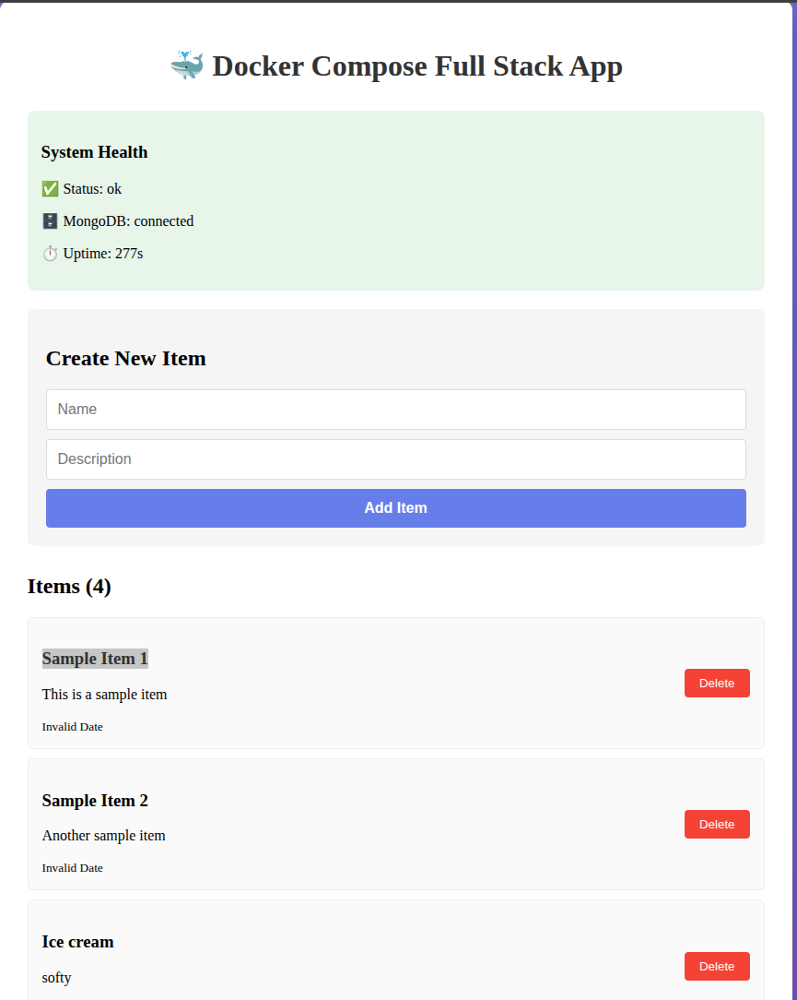
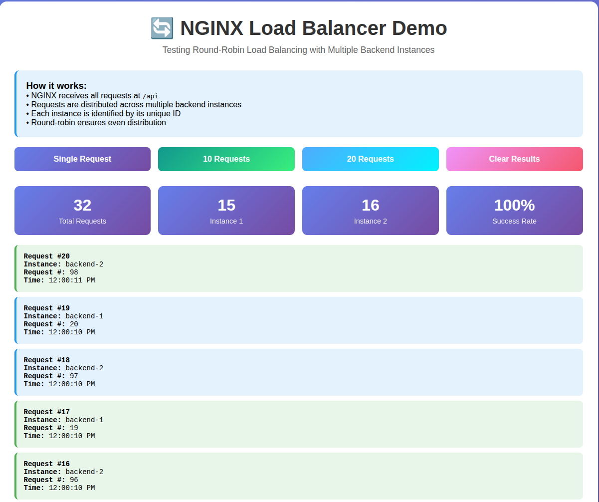
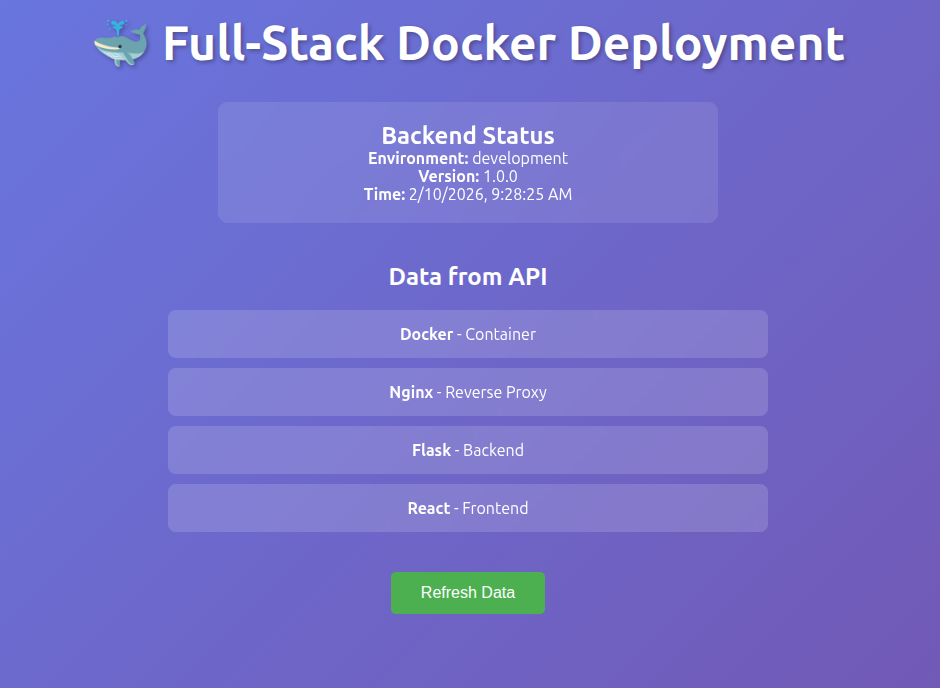

# Week 5: Server Side Foundations with Docker & DevOps Basics


## Table of Contents

- [Overview](#overview)
- [Learning Objectives](#learning-objectives)
- [Project Structure](#project-structure)
- [Day-wise Implementation](#day-wise-implementation)
  - [Day 1: Docker Fundamentals + Linux Internals](#day-1-docker-fundamentals--linux-internals)
  - [Day 2: Docker Compose + Multi-Container Apps](#day-2-docker-compose--multi-container-apps)
  - [Day 3: NGINX Reverse Proxy + Load Balancing](#day-3-nginx-reverse-proxy--load-balancing)
  - [Day 4: SSL + Self-Signed + mkcert + HTTPS](#day-4-ssl--self-signed--mkcert--https)
  - [Day 5: CI-Style Deployment Automation + Capstone](#day-5-ci-style-deployment-automation--capstone)
- [Prerequisites](#prerequisites)
- [Quick Start](#quick-start)
- [Key Learnings](#key-learnings)
- [Author](#author)

---

## 🎯 Overview

This project demonstrates **production-grade server deployment practices** using Docker and DevOps fundamentals. Over 5 days, I built a complete containerized full-stack application with reverse proxy, load balancing, HTTPS, and production-ready deployment automation.

**Objective:** Understand how production servers work by simulating deployment environments locally using Docker.

---

## 🎓 Learning Objectives

By completing this week's tasks, I gained hands-on experience with:

- Docker fundamentals: images, containers, volumes, networks
- Linux internals inside containers
- Multi-container orchestration with Docker Compose
- Reverse proxy and load balancing with NGINX
- SSL/TLS implementation and HTTPS termination
- Production deployment automation
- Security best practices and environment management

---

## Project Structure

```
WEEK_5-SERVER_SIDE_FOUNDATIONS_WITH_DOCKER_AND_DEVOPS_BASICS/
│
├── DAY_1-DOCKER_FUNDAMENTALS/
│   ├── Dockerfile
│   ├── server.js
│   ├── package.json
│   ├── linux-in-container.md
│   └── SCREENSHOTS/
│
├── DAY_2-DOCKER_COMPOSE_AND_MULTI_CONTAINER_APPS/
│   ├── docker-compose.yml
│   ├── backend/
│   ├── server/
│   ├── frontend/
│   ├── client/
│   ├── service-architecture.md
│   └── SCREENSHOTS/
│
├── DAY_3-NGINX_REVERSE_PROXY_AND_LOAD_BALANCING/
│   ├── docker-compose.yml
│   ├── nginx/
│   │   └── nginx.conf
│   ├── backend/
│   ├── frontend/
│   ├── reverse-proxy-readme.md
│   └── SCREENSHOTS/
│
├── DAY_4-SSL_SELF_SIGNED_MKCERT_HTTPS/
│   ├── docker-compose.yml
│   ├── nginx/
│   │   ├── nginx.conf
│   │   └── certs/
│   │       ├── localhost.pem
│   │       └── localhost-key.pem
│   ├── backend/
│   ├── frontend/
│   ├── ssl-setup.md
│   └── SCREENSHOTS/
│
├── DAY_5-CI_STYLE_DEPLOYMENT_AUTOMATION_CAPSTONE/
│   ├── docker-compose.prod.yml
│   ├── .env.example
│   ├── deploy.sh
│   ├── nginx/
│   ├── backend/
│   ├── frontend/
│   ├── production-guide.md
│   └── SCREENSHOTS/
│
├── .gitignore
└── README.md
```

---

## Day-wise Implementation

### Day 1: Docker Fundamentals + Linux Internals

**Topics Covered:**
- Docker images, containers, volumes, and networks
- Basic container OS operations
- Users, permissions, logs, and processes inside containers
- Dockerfile basics

**Exercise:**
- Created a containerized Node.js application
- Explored container internals using `docker exec -it <container> /bin/sh`
- Executed Linux commands: `ls`, `ps`, `top`, `df`, `cat /var/log/*`

**Deliverables:**
- ✅ `Dockerfile` - Container definition for Node.js app
- ✅ `linux-in-container.md` - Documentation of container exploration

### Day 2: Docker Compose + Multi-Container Apps

**Topics Covered:**
- Docker networking between containers
- Volumes for persistent storage
- Docker Compose for orchestrating multiple services

**Exercise:**
Deployed a full-stack application with:
- **Client:** React frontend
- **Server:** Node.js/Express backend
- **Database:** MongoDB

All services started with a single command: `docker-compose up -d`

**Deliverables:**
- `docker-compose.yml` - Multi-container orchestration
- `service-architecture.md` - System architecture documentation

#### Screenshots

**Docker Compose Deployment:**


*Starting all services with docker-compose up -d*
---

### Day 3: NGINX Reverse Proxy + Load Balancing

**Topics Covered:**
- NGINX as a reverse proxy in Docker
- Routing requests to internal containers
- Load balancing with multiple backend replicas

**Exercise:**
- Deployed two backend instances
- Configured NGINX as reverse proxy: `/api` → `backend-service:3000`
- Implemented round-robin load balancing

**Deliverables:**
- `nginx.conf` - Reverse proxy configuration
- `reverse-proxy-readme.md` - Documentation

#### Screenshots
**Load Balancing in Action:**


*Two backend instances running*

---

### Day 4: SSL + Self-Signed + mkcert + HTTPS

**Topics Covered:**
- SSL/TLS fundamentals
- Certificate generation with mkcert
- HTTPS termination at NGINX
- HTTP to HTTPS redirection

**Exercise:**
- Generated self-signed certificates using `mkcert`
- Configured NGINX for HTTPS on port 443
- Forced HTTP → HTTPS redirect
- Verified SSL lock icon in browser

**Deliverables:**
- SSL Certificates (`localhost.pem`, `localhost-key.pem`)
- `ssl-setup.md` - SSL configuration documentation
- HTTPS working screenshots

#### Screenshots

**Certificate Generation:**


---

### Day 5: CI-Style Deployment Automation + Capstone

**Topics Covered:**
- Production-ready Docker configuration
- Environment variable management
- Health checks and monitoring
- Container restart policies
- Deployment automation scripts

**Capstone Project:**
Deployed a complete full-stack application with:
- Production-optimized `docker-compose.prod.yml`
- Environment secrets in `.env` (not committed)
- Health checks for all services
- Automatic restart policies
- Deployment automation script
- NGINX reverse proxy with HTTPS

**Deliverables:**
- `docker-compose.prod.yml` - Production configuration
- `deploy.sh` - Automated deployment script
- `production-guide.md` - Complete deployment guide
- `.env.example` - Environment template

#### Screenshots

**Complete Stack Running:**

*Container logs and monitoring*

---

## 🛠️ Prerequisites

Before running this project, ensure you have:

- **Docker:** Version 20.10 or higher
- **Docker Compose:** Version 2.0 or higher
- **Node.js:** Version 16.x or higher (for local development)
- **mkcert:** For SSL certificate generation
- **Git:** For version control

### Installation Commands:

```bash
# Install Docker (Ubuntu/Debian)
sudo apt update
sudo apt install docker.io docker-compose

# Install mkcert
sudo apt install mkcert
# or
brew install mkcert  # macOS

# Install mkcert root CA
mkcert -install

# Verify installations
docker --version
docker-compose --version
node --version
mkcert --version
```

---

## Quick Start

### Clone the Repository

```bash
git clone url <origin>
cd WEEK_5-SERVER_SIDE_FOUNDATIONS_WITH_DOCKER_AND_DEVOPS_BASICS
```

### Day 1: Docker Fundamentals

```bash
cd DAY_1-DOCKER_FUNDAMENTALS

# Build Docker image
docker build -t node-app .

# Run container
docker run -d -p 3000:3000 --name node-container node-app

# Access container shell
docker exec -it node-container /bin/sh

# Explore container
ls
ps aux
top
df -h

# View logs
docker logs node-container

# Stop and remove
docker stop node-container
docker rm node-container
```

### Day 2: Multi-Container App

```bash
cd DAY_2-DOCKER_COMPOSE_AND_MULTI_CONTAINER_APPS

# Start all services
docker-compose up -d

# View running containers
docker-compose ps

# View logs
docker-compose logs -f

# Access application
# Frontend: http://localhost:3000
# Backend: http://localhost:5000
# MongoDB: localhost:27017

# Stop services
docker-compose down

# Stop and remove volumes
docker-compose down -v
```

### Day 3: NGINX Reverse Proxy

```bash
cd DAY_3-NGINX_REVERSE_PROXY_AND_LOAD_BALANCING

# Start services with NGINX
docker-compose up -d

# Scale backend instances
docker-compose up -d --scale backend=2

# Test reverse proxy
curl http://localhost/api

# View NGINX logs
docker-compose logs nginx

# Stop services
docker-compose down
```

### Day 4: HTTPS with SSL

```bash
cd DAY_4-SSL_SELF_SIGNED_MKCERT_HTTPS

# Generate SSL certificates (if not already done)
cd nginx/certs
mkcert localhost 127.0.0.1
cd ../..

# Start services with HTTPS
docker-compose up -d

# Test HTTPS
curl -k https://localhost
# or open in browser: https://localhost

# Verify certificate
openssl s_client -connect localhost:443

# Stop services
docker-compose down
```

### Day 5: Production Deployment

```bash
cd DAY_5-CI_STYLE_DEPLOYMENT_AUTOMATION_CAPSTONE

# Copy environment template
cp .env.example .env

# Edit .env with your configuration
nano .env

# Run deployment script
chmod +x deploy.sh
./deploy.sh

# Or manually deploy
docker-compose -f docker-compose.prod.yml up -d

# Check health status
docker-compose -f docker-compose.prod.yml ps

# View logs
docker-compose -f docker-compose.prod.yml logs -f

# Stop production services
docker-compose -f docker-compose.prod.yml down
```

---

## Key Learnings

### Docker Fundamentals
- Understanding the difference between images and containers
- How to write efficient Dockerfiles
- Container lifecycle management
- Linux internals and how containers isolate processes

### Container Networking
- Bridge networks for container communication
- Service discovery using container names
- Port mapping and exposure
- Network isolation and security

### Docker Compose
- Multi-container orchestration
- Service dependencies and startup order
- Volume management for data persistence
- Environment variable configuration

### Reverse Proxy & Load Balancing
- NGINX as a reverse proxy
- Load balancing algorithms (round-robin)
- Header forwarding and proxy configuration
- Scaling backend services

### SSL/TLS & Security
- SSL/TLS certificate generation
- HTTPS termination at reverse proxy
- HTTP to HTTPS redirection
- Security best practices

### Production Deployment
- Environment-based configuration
- Health checks and monitoring
- Container restart policies
- Automated deployment scripts
- Log management

---

## 🔧 Useful Docker Commands

```bash
# Container Management
docker ps                           # List running containers
docker ps -a                        # List all containers
docker logs <container>             # View container logs
docker exec -it <container> /bin/sh # Access container shell
docker stop <container>             # Stop container
docker rm <container>               # Remove container

# Image Management
docker images                       # List images
docker build -t <name> .            # Build image
docker rmi <image>                  # Remove image
docker pull <image>                 # Pull image from registry

# Docker Compose
docker-compose up -d                # Start services in background
docker-compose down                 # Stop and remove services
docker-compose ps                   # List services
docker-compose logs -f              # Follow logs
docker-compose exec <service> sh    # Execute command in service
docker-compose restart <service>    # Restart service

# Network Management
docker network ls                   # List networks
docker network inspect <network>    # Inspect network
docker network create <network>     # Create network

# Volume Management
docker volume ls                    # List volumes
docker volume inspect <volume>      # Inspect volume
docker volume rm <volume>           # Remove volume

# System Cleanup
docker system prune                 # Remove unused data
docker system prune -a              # Remove all unused data
docker volume prune                 # Remove unused volumes
```

---

## 📖 Documentation

Each day's folder contains detailed documentation:

- **Day 1:** `linux-in-container.md` - Container exploration guide
- **Day 2:** `service-architecture.md` - Multi-container architecture
- **Day 3:** `reverse-proxy-readme.md` - NGINX configuration guide
- **Day 4:** `ssl-setup.md` - SSL/TLS setup instructions
- **Day 5:** `production-guide.md` - Production deployment guide

---

## Project Highlights

**100% Containerized** - All services run in Docker containers 
**Production-Ready** - Includes health checks, restart policies, and environment config 
**Secure** - HTTPS with SSL/TLS encryption 
**Scalable** - Load balancing support for horizontal scaling 
**Well-Documented** - Comprehensive documentation for each component 
**Automated** - Deployment scripts for one-command deployment 
---

